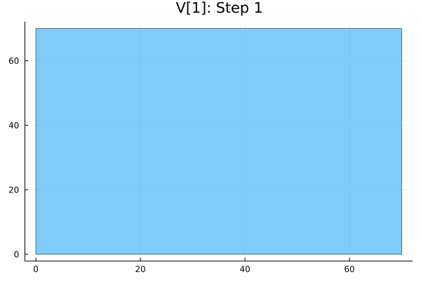

# CorrelatedEquilibria.jl

Description

# Project Structure

- **[CorrelatedEquilibria](src/CorrelatedEquilibria.jl)**: Module that contains the main parts of the algorithm. 

- **[Utilities](src/Utils.jl)**: Contains different helper functions used in the process.

- **[Plotting](src/Plotting.jl)**: Contains plotting functions.

- **[Test Script](test/runtest.jl)**: Contains test scripts.

- **[Test Game 1](test/test_game1.yml)**: Test game with one state to show the desired file structure and demonstrate the capabilities.

- **[Test Game 2](test/test_game2.yml)**: Test game with multiple states

- **[Game Template](test/game_template.yml)**: Template .yml file for a stochastic game in the desired form

# Setup

(Note: The package is yet to be published)

To install the package, use the following command inside the Julia REPL:
```julia
using Pkg
Pkg.add("CorrelatedEquilibria")
```
To load the package, use the command:

```julia
using CorrelatedEquilibria
```

# Examples

**[Test Game 1 (Game of Chicken):](test/test_game1.yml)**
- 1 state 
- 2 players
- 4 joint actions


### Initial Hypercube:


### Correlated Equilibria:


### Algorithm progress:




**[Test Game 2 (The Breakup Game):](test/test_game2.yml)**
- 3 states
- 2 players
- 5 joint actions


### Initial Hypercube:

 

### Correlated Equilibria:


### Algorithm progress:


# How to use the package

First you need to construct the .yml file to describe the stochastic game. The desired format can be found derived from the example games as well as the **[game template](test/game_template.yml)**.

Afterwards you need to build the game from the .yml file.
```julia
game = build_game(path)
```
Afterwards you can just execute the algorithm with the following line:
```julia
(V,X, animArr) = computeCE(game, gamma, steps, plotting, outerError)

#=
Params:
    game (Struct Markov Game): Stochastic Game
    gamma (Float): discount factor 
    steps (Int): number of steps the algorithm should be executed
    plotting (Bool): if gif should be produced or not
    outerError (Float): outer Error for over approximation
Returns:
    V (Vector): Set of value vectors that are in the correlated equilibria
    X (Matrix): Constraint vectors for final V
    animArr (gif): Set of plots that show progress of V for each state
=#
```

<details>
<summary>Additional functions</summary>
<h1 style="display:inline-block"></h1>

Find the maximum payoff that exists for any player in a game
```julia
max = maxPayoff(game)
```
Find the minimal payoff that exists for any player in a game
```julia
min = minPayoff(game)
```
Compute the initial hypercube
```julia
V = initializeV(game, discountFactor)
```
Compute all value vectors 
```julia
Q = computeQ(game, V, discountFactor)
```
</details>

<details>
<summary>Plotting functions</summary>
<h1 style="display:inline-block"></h1>

This function creates and saves a png of the desired state of V with the vertices
```julia
plot_V(V, stateNumber, path (optional)) 
#= 
Params:
    V (Vector): Set of value vectors that are in the correlated equilibria
    sID (Int): State for which the progress shall be shown
    s (String): Name of the state
    path (String): optional path where to save gif
=#   
```

This function creates and saves a gif of the progress of V during the algorithm steps
```julia
plot_V_progress(animArr, sID, path="empty", fps=5)
#= 
Params:
    animArr (Array): Array which contains animations of the progress
    sID (Int): State for which the progress shall be shown
    path (String): optional path where to save gif
    fps (Int): frames per seconds
=#  
```
</details>

&nbsp; 

# References

[1] **Finding correlated equilibria in general sum stochastic games**, Murray, Chris and Gordon, Geoff, 2007
